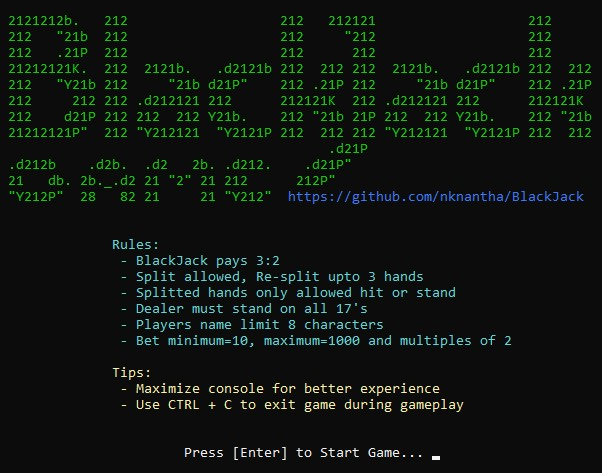

<h1 align="center">BlackJack</h1>

<p align="center">A Python implementation of BlackJack with CUI.</p>

## Usage
```
python BlackJack.py
```

## Dependency
```
python >= 3.8 (tested)
colorama >= 0.4.4
```

## Screenshots
<p align="center">


</p>